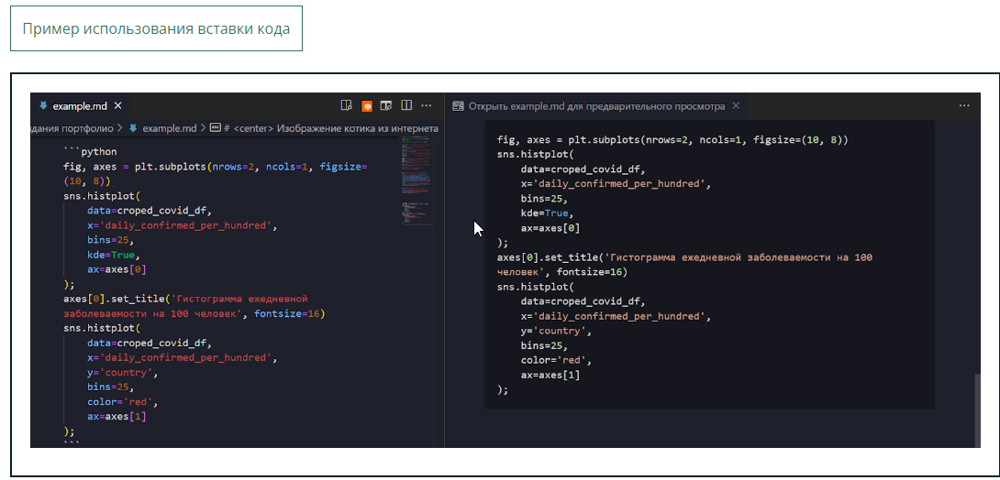
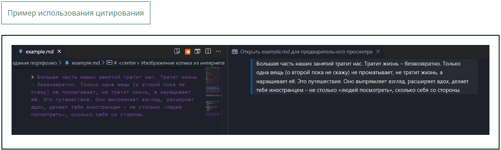

# Markdown (Заголовок - ур. 1)
## Markdown (Заголовок - ур. 2)
### Markdown (Заголовок - ур. 3)
#### Markdown (Заголовок - ур. 4)
##### Markdown (Заголовок - ур. 5)
###### Markdown (Заголовок - ур. 6)

*Markdown (Курсив)*

**Markdown (жирненький)**


***Markdown (жирненький - наколнный)***

Ниже представлен пример отображения разметки на языке Markdown, написанной в файле README.md в [репозитории](https://github.com/laravel/laravel).

<strong> MarkDown </strong> - простоя язык разметки

Список всех HTML-тегов вы можете найти [здесь](https://html5book.ru/html-tags/).

# <center> Центрирование заголовка </center>

- Список (вариант 1)
* Список (вариант 2)
+ Список (вариант 3)
    + вложенный спсок

1. Нумерация
2. Нумерация

# Обозначение кода

- одинарный парный — для вставки строки кода в текст;
- двойной парный — для вставки небольшого участка кода, содержащего -одинарный апостроф, в текст;
- тройной парный — для вставки блока программного кода.

`print('Hello world!')` - обозначение кода 

```python

lst = [10, 34, 21, 21, 3]

summa = sum(lst)

```


***Для оформления цитат используется знак «больше» (>):***

> Цитируемый текст


# ФОРМУЛЫ
**Когда в проекте есть математическая составляющая, важно отразить её в описании.**

Чтобы начать использовать KaTeX в Markdown, необходимо воспользоваться символом '$'.

Если обрамить формулу с обеих сторон одним символом $, то её можно встроить в текст, а если двумя — формула автоматически центрируется.

**Например, следующий синтаксис**

Пусть задано выражение:

$$a = b +c,$$

где $a=0$

**Греческие символы**

$\alpha$

$\gamma$

$\sigma$

**Степени**

$a^2$

$b_{ij}$

$w^{ij}_n$

**Для того чтобы создать «двухэтажную» дробь, можно воспользоваться оператором \frac с двумя параметрами, которые передаются в фигурных скобках (числитель и знаменатель). Например:**

$\frac{1+x}{n}$

**Вставка изображения по ссылке**


$f(x) = \frac{1+x^2}{x^2+5x+1}$

# ***Можно настраивать размеры изображений***
<center>  </center>

Face Mask Detection system built with OpenCV, Keras/TensorFlow using Deep Learning and Computer Vision concepts in order to detect face masks in static images as well as in real-time video streams.

<center>  </center>