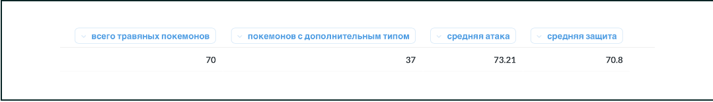

*Давайте посчитаем количество строк в таблице. Для этого применим агрегатную функцию COUNT.*

**SELECT
    COUNT(*)
FROM sql.pokemon**

*COUNT считает строки, а звёздочка (*) в аргументе функции означает, что считаются все строки, которые возвращает запрос.*

***Если в аргументе функции указать название столбца, функция обработает только строки с непустым значением.***

*Внутри функции COUNT мы можем также применять DISTINCT, чтобы вычислить количество уникальных значений.*

**SELECT
    COUNT(DISTINCT type1)
FROM sql.pokemon**

***Назовём основные агрегатные функции, с которыми нам предстоит работать:***

**COUNT** — вычисляет число непустых строк;
**SUM** — вычисляет сумму;
**AVG** — вычисляет среднее;
**MAX** — вычисляет максимум;
**MIN** — вычисляет минимум.

***Разумеется, вы можете использовать в запросе фильтрацию строк с помощью WHERE, чтобы получить агрегированное значение только для отдельных строк.***

*Кроме того, мы можем применять несколько агрегатных функций в одном запросе.*

**SELECT
    COUNT(*) AS "всего травяных покемонов",
    COUNT(type2) AS "покемонов с дополнительным типом",
    AVG(attack) AS "средняя атака",
    AVG(defense) AS "средняя защита"
FROM sql.pokemon
WHERE type1 = 'Grass'**

*В результате получим следующий вывод:*
