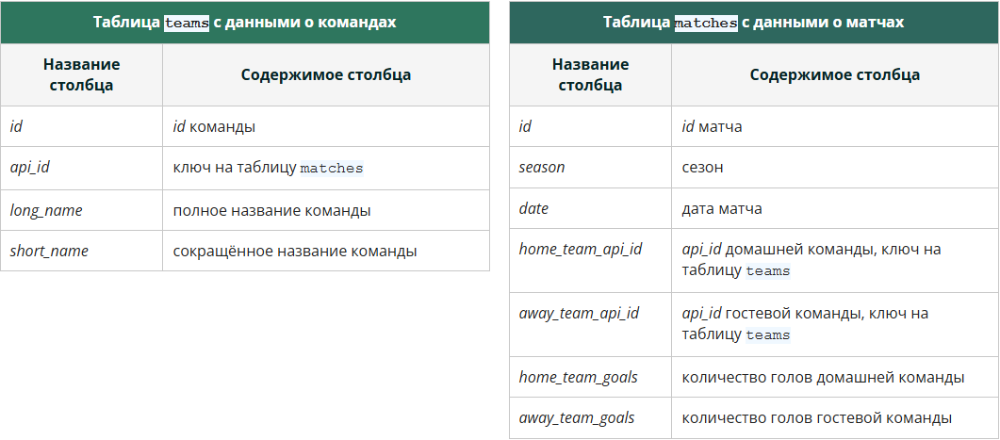

*Первым делом — знакомимся с датасетом.*

*В этом модуле мы будем работать с таблицами о футбольных матчах и командах.*

*Таблицы этого модуля, как и все другие в курсе, лежат в схеме sql в [Metabase](http://sql.skillfactory.ru:3000/). Нам понадобятся таблицы teams и matches.*

***Примечание. Как и в предыдущих модулях, вы можете посмотреть подробный разбор структуры предлагаемых запросов во вкладке Детализация.***

### Задание 1.2 

**select
    season,
    sum(home_team_goals) as total_home_goals,
    sum(away_team_goals) as total_away_goals
from sql.matches
group by season
order by season**