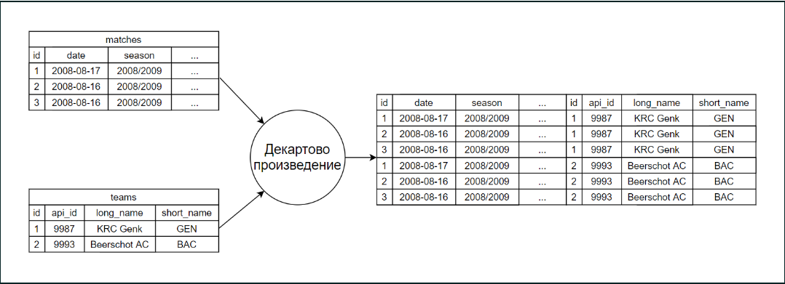
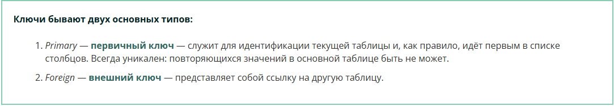

# Объединяем таблицы без операторов

*Существует несколько способов соединения таблиц. Мы познакомимся со всеми основными операторами, которые используются для этих нужд, но начнём с простого метода объединения таблиц — без операторов.*

*Чтобы соединить две таблицы между собой, достаточно записать названия таблиц через запятую в разделе from. Что произойдёт в таком случае?*

**SELECT *
FROM
    sql.teams,
    sql.matches**

*Каждая запись, которая есть в таблице teams, будет соединена с каждой записью в таблице matches.*

*Это действие также называют декартовым произведением таблиц.*

*Действительно ли это произведение?*

*Легко проверить! В исходных таблицах teams и matches было 299 и 25083 записей соответственно. Если соединить каждую запись одной таблицы с каждой записью другой, получится 299 * 25083 записей в итоговой таблице.*

### Задание 2.1
***Напишите запрос, который выведет количество строк соединённой таблицы.***

**SELECT
    count(*)
FROM
    sql.teams,
    sql.matches**

*В данном случае соединение таблиц не даёт практической пользы: мы получили очень много записей, которые никак не можем интерпретировать, потому что команды не соответствуют матчам.*

*Давайте исправим это. В таблице teams есть столбец api_id, а таблица matches содержит столбцы home_team_api_id и away_team_api_id — это ключи таблиц, по которым они соединяются.*

***Ключ — это поле (столбец) в таблице, которое позволяет однозначно идентифицировать запись (строку).***

*Чтобы соединить таблицы и получить данные о домашней команде по каждому матчу, добавим условие* ***where home_team_api_id = api_id.***

**SELECT *
FROM
    sql.teams,
    sql.matches
WHERE home_team_api_id = api_id**

*Аналогично можем получить данные о гостевых командах: необходимо изменить условие на* ***where away_team_api_id = api_id.***

**SELECT *
FROM
    sql.teams,
    sql.matches
WHERE away_team_api_id = api_id**

***Итак, мы только что объединили таблицы по ключу.***

*Вы уже знакомы с ключами по таблице pokemon (там в этой роли выступал столбец id). Ключи нужны для того, чтобы иметь возможность не перепутать между собой различные записи.*

*Например, у нас есть несколько команд с одинаковым названием: Polonia Bytom, Widzew Łódź и Royal Excel Mouscron — хотя это разные команды, с разными id.*

*Кроме того, как мы уже смогли убедиться, ключи используются для соединения таблиц между собой.*

*Как правило, названия ключей имеют «хвост», который позволяет их идентифицировать: например, _id, _rk, _cd, _pk (от primary_key), _fk (от foreign_key) и другие.*

***Обратите внимание! В данном датасете ключ api_id таблицы teams может быть использован в разных значениях. Его можно использовать для того, чтобы получить информацию о домашней (home) или гостевой (away) команде.***

*Вы могли заметить, что в последних двух запросах получилось очень много столбцов. Как и при работе с одиночной таблицей, мы можем выбирать, какие столбцы соединённой таблицы выводить.*

*С помощью известного нам запроса получим названия команд, игравших домашние матчи, и счёт матчей.*

**SELECT 
    long_name, 
    home_team_goals,
    away_team_goals
FROM
    sql.teams,
    sql.matches
WHERE home_team_api_id = api_id**