# Операторы

### INNER JOIN

*INNER JOIN — это тот же JOIN (слово inner в операторе можно опустить).*

*Принцип работы этого оператора визуализирует изображение ниже.*

***Для INNER JOIN работает следующее правило: присоединяются только те строки таблиц, которые удовлетворяют условию соединения. Если в любой из соединяемых таблиц находятся такие строки, которые не удовлетворяют заявленному условию, — они отбрасываются.***

*Рассмотрим на примере нашего датасета.*

*В таблице teams есть данные о 299 различных командах — можем проверить это с помощью запроса.*

**SELECT 
COUNT(DISTINCT id)
FROM sql.teams**

*или*

**SELECT 
COUNT(DISTINCT api_id)
FROM sql.teams**

*Теперь добавим к teams таблицу с матчами.*

**SELECT 
COUNT(DISTINCT t.id) 
FROM 
sql.teams t
JOIN sql.matches m ON t.api_id = m.home_team_api_id OR t.api_id = m.away_team_api_id**

*И в таблице останется уже не 299 команд, а только 292.*

*Почему?*

*Дело в том, что таблица sql.matches по какой-то причине не содержит информацию о командах Lierse SK, KVC Westerlo, KAS Eupen, Club Brugge KV, KV Oostende, RSC Anderlecht и Hull City, зато они есть в таблице sql.teams. Возможно, эти команды не участвовали ни в одном матче или записи по этим матчам были удалены.*

### LEFT OUTER JOIN и RIGHT OUTER JOIN

*Также существуют схожие друг с другом типы соединения — LEFT JOIN и RIGHT JOIN (слово outer в операторе можно опустить).*

*Принцип работы оператора можно описать так:*

***Для LEFT JOIN работает следующее правило: из левой (относительно оператора) таблицы сохраняются все строки, а из правой добавляются только те, которые соответствуют условию соединения. Если в правой таблице не находится соответствия, то значения строк второй таблицы будут иметь значение NULL.***

*LEFT JOIN может быть полезен, когда соответствующих записей во второй таблице может не быть, но важно сохранить записи из первой таблицы.*

*Почему соответствий может не быть?*

*Причины могут быть разные, назовём две основные:*

***1. Различная бизнес-логика таблиц.***

*Пример: в интернет-магазине почти всегда можно оформить заказ с промокодом. Вполне вероятно, что информация о промокодах хранится в отдельной таблице, но при этом не для каждого заказа будет существовать промокод, поскольку покупку можно оформить и без него.*

***2. Разное время обновления таблиц.***

*Пример: клиент зарегистрировался на сайте интернет-магазина и оформил заказ. Данные о регистрации клиентов могут обновляться в базе данных раз в неделю, а о заказах — раз в сутки.*

*Поставим следующую задачу: вывести полные названия команд, данных по которым нет в таблице matches.*

*Для начала посмотрим на результат запроса после соединения.*

**SELECT
    t.long_name,
    m.id
FROM sql.teams t
LEFT JOIN sql.matches m ON t.api_id = m.home_team_api_id OR t.api_id = m.away_team_api_id
ORDER BY m.id DESC**

***Вывод: в таблице teams сохранились все записи, а в таблице matches есть пустые строки.***

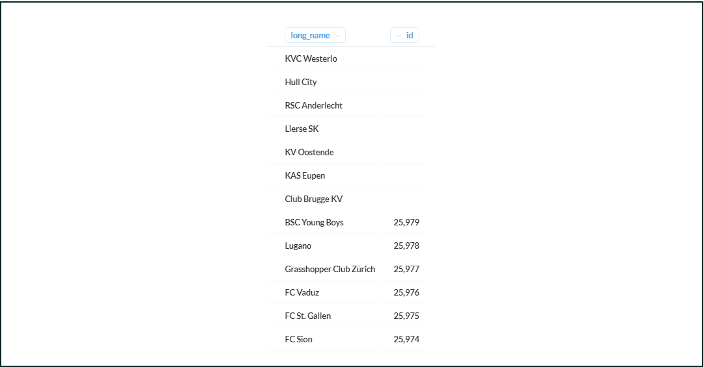

*Теперь, чтобы выбрать такие команды, которые не принимали участия в матчах, достаточно добавить условие where m.id is null (или любое другое поле таблицы matches).*

**SELECT
    t.long_name
FROM 
    sql.teams t
LEFT JOIN sql.matches m ON t.api_id = m.home_team_api_id OR t.api_id = m.away_team_api_id
WHERE m.id IS NULL**

***Обратите внимание! Если мы добавим какой-либо фильтр по отличному от NULL значению для таблицы matches, то LEFT JOIN превратится в INNER JOIN, поскольку для второй таблицы станет необходимым присутствие такого (NOT NULL) значения в строке.***

**SELECT
    t.long_name FROM sql.teams t
LEFT JOIN sql.matches m ON t.api_id = m.home_team_api_id OR t.api_id = m.away_team_api_id
WHERE
    m.season = '2008/2009'
AND t.long_name = 'KAS Eupen'**

*В ответе Metabase получим No results!, так как вместе с фильтром m.season = '2008/2009' исчезли все строки, значения которых NULL.*

### Задание 5.1 

***Используя LEFT JOIN, выведите список уникальных названий команд, содержащихся в таблице matches. Отсортируйте список в алфавитном порядке.***

**SELECT
    distinct long_name
FROM sql.matches m
left JOIN sql.teams t ON t.api_id = m.home_team_api_id OR t.api_id = m.away_team_api_id
order by long_name**

*С LEFT JOIN также работают агрегатные функции, что позволяет не потерять значения из левой таблицы. Например, мы можем вывести сумму голов команд по гостевым матчам.*

**SELECT
    t.long_name,
    SUM(m.away_team_goals) total_goals
FROM   
    sql.teams t
LEFT JOIN sql.matches m ON t.api_id = m.away_team_api_id
GROUP BY t.id
ORDER BY 2 DESC**

***Обратите внимание! При применении функций SUM, MIN, MAX, AVG к полям со значением NULL в результате получится NULL, а не 0. А при использовании функции COUNT, наоборот, получится 0.***

### Задание 5.2 

*Используя LEFT JOIN, напишите запрос, который выведет полное название команды (long_name), количество матчей, в которых участвовала команда, — домашних и гостевых (matches_cnt). Отсортируйте по количеству матчей в порядке возрастания, затем — по названию команды в алфавитном порядке.*

**SELECT
    t.long_name,
    count(m.away_team_api_id + m.home_team_api_id) as matches_cnt 
FROM   
    sql.teams t
LEFT JOIN sql.matches m ON t.api_id = m.away_team_api_id or t.api_id = m.home_team_api_id
GROUP BY t.id
ORDER BY matches_cnt, long_name**

*При использовании RIGHT JOIN сохраняется та же логика, что и для LEFT JOIN, только за основу берётся правая таблица. Чтобы из LEFT JOIN получить RIGHT JOIN, нужно просто поменять порядок сое*

***Вообще, применение RIGHT JOIN считается плохим тоном, так как язык SQL читается и пишется слева направо, а такой оператор усложняет чтение запросов.***

### FULL OUTER JOIN

*Оператор FULL OUTER JOIN объединяет в себе LEFT и RIGHT JOIN и позволяет сохранить кортежи обеих таблиц. Даже если не будет соответствий, мы сохраним все записи из обеих таблиц.*

*FULL OUTER JOIN может быть полезен в ситуациях, когда схема данных недостаточно нормализована и не хватает таблиц-справочников.*

***Пример: в базе данных интернет-магазина есть две таблицы — с зарегистрированными пользователями и пользователями, оформившими заказ. При этом оформить заказ можно без регистрации, а зарегистрироваться — без оформления заказа.***

*Предположим, что вам необходимо получить полный список пользователей — и оформивших заказ, и зарегистрированных, — но в базе данных этой объединённой таблицы нет. В данном случае можно использовать FULL OUTER JOIN для получения полного списка, соединив таким образом таблицы c заказами и регистрациями по id пользователя.*

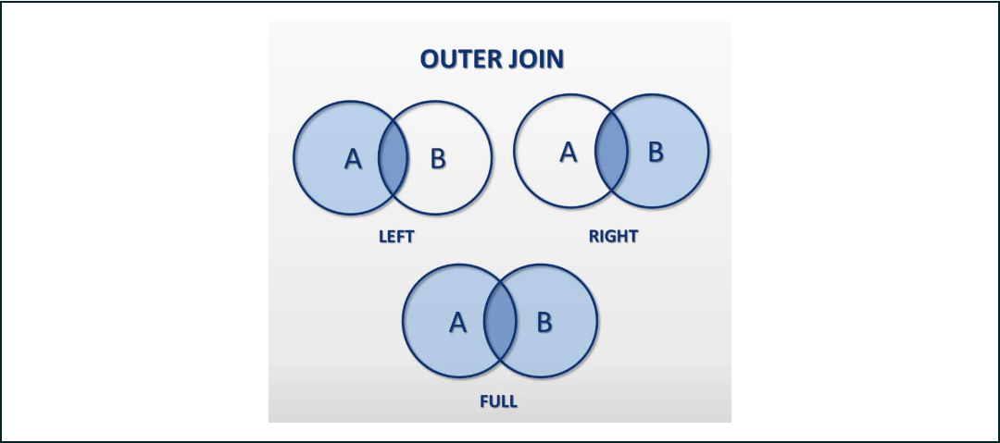

*Синтаксис FULL OUTER JOIN аналогичен другим JOIN.*

**SELECT 
…
FROM
	table1
FULL OUTER JOIN table2 ON условие**

### Cross Join

*На самом деле с этим оператором соединения таблиц вы познакомились в самом начале текущего модуля.*

***CROSS JOIN соединяет таблицы так, что каждая запись в первой таблице присоединяется к каждой записи во второй таблице, иначе говоря, даёт декартово произведение.***

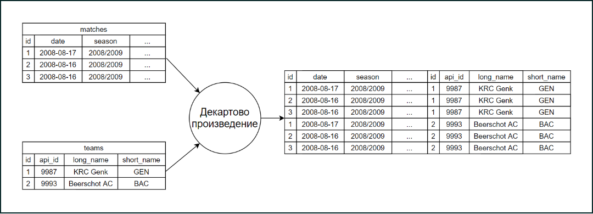

*В начале модуля вы использовали этот оператор, записывая таблицы через запятую.*

**SELECT *
FROM
    sql.teams,
    sql.matches**

*Этот же запрос можно записать с использованием CROSS JOIN.*

**SELECT *
FROM
    sql.teams
    CROSS JOIN sql.matches**

***Обратите внимание! Условие для CROSS JOIN, в отличие от других операторов, не требуется.***

*Также этот запрос можно записать с помощью INNER JOIN с условием on true — результат будет тот же.*

**SELECT *
FROM
    sql.teams
    JOIN sql.matches ON TRUE**

*CROSS JOIN может быть полезен, когда необходимо создать таблицу фактов.*

*Например, с помощью такого запроса мы можем получить все возможные комбинации полных названий команд в матчах.*

**SELECT
    DISTINCT
    t1.long_name home_team, 
    t2.long_name away_team
FROM
    sql.teams t1
    CROSS JOIN sql.teams t2**

### Задание 5.3

*Напишите запрос, который выведет все возможные уникальные комбинации коротких названий домашней команды (home_team) и коротких названий гостевой команды (away_team). Команда не может сама с собой играть, то есть быть и домашней, и одновременно гостевой (в одном и том же матче). Отсортируйте запрос по первому и второму столбцам.*

**SELECT
    DISTINCT
    t1.short_name home_team, 
    t2.short_name away_team
FROM
    sql.teams t1
    CROSS JOIN sql.teams t2
where t1.id != t2.id
order by t1.short_name, t2.short_name**

### NATURAL JOIN

*Ключевое слово natural в начале оператора JOIN позволяет не указывать условие соединения таблиц — для соединения будут использованы столбцы с одинаковым названием из этих таблиц.*

***NATURAL JOIN*** *можно использовать с любыми видами соединений, которые требуют условия соединения:*

- NATURAL INNER JOIN (возможна запись NATURAL JOIN);
- NATURAL LEFT JOIN;
- NATURAL RIGHT JOIN;
- NATURAL FULL OUTER JOIN.

*-При использовании NATURAL JOIN прежде всего стоит обратить внимание на ключи таблиц. Для наших таблиц teams и matches этот вид соединения не подойдёт, так как общим для обеих таблиц является столбец id, но таблицы соединяются по другим столбцам.*

*Когда у таблиц есть несколько столбцов с одинаковыми именами, при NATURAL JOIN условие соединения будет применено на все столбцы с одинаковыми именами.*

*То есть для таблиц table1 и table2*

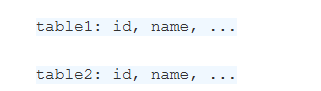

*запрос*

**SELECT 
…
FROM          table1 NATURAL JOIN table2**

*будет равнозначен запросу*

**SELECT
…
FROM          table1 t1
INNER JOIN table2 t2 ON t1.id = t2.id AND t1.name = t2.name**

### Общая логика построения запроса с JOIN

*При построении запроса с несколькими JOIN старайтесь идти слева направо. Сначала выберите таблицу, которая является центральной в соответствии с поставленной задачей, вопросом. Затем добавляйте таблицы поэтапно в зависимости от бизнес-логики запроса.*

*Например, для ответа на вопрос: «Какая команда сыграла больше всех матчей в сезоне 2010/2011?» в качестве центральной лучше выбрать таблицу с командами.*

*А для ответа на вопрос: «В каком сезоне участвовало больше всего команд?» — таблицу с матчами.*

***Стоит отметить, что из рассмотренных видов соединений чаще всего используются INNER JOIN и LEFT JOIN. Другие операторы используются реже, но стоит помнить об их существовании при решении нестандартных задач.***

### ВИДЫ JOIN

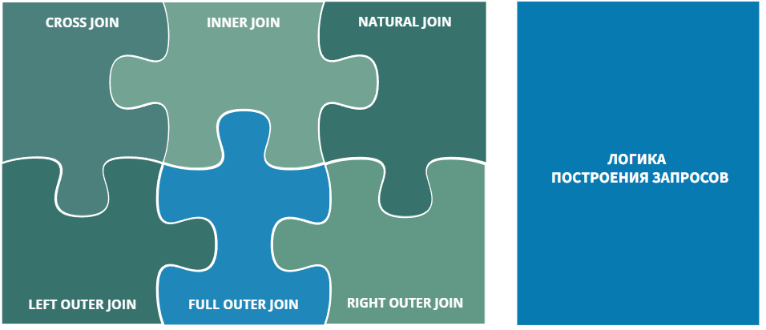

- 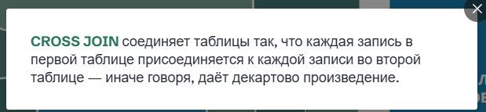

- 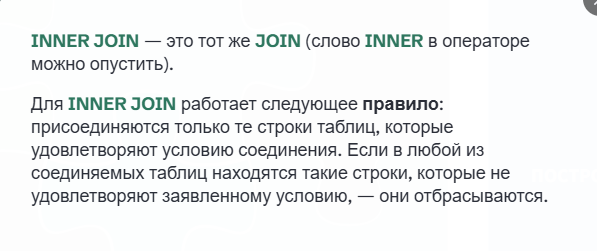

- 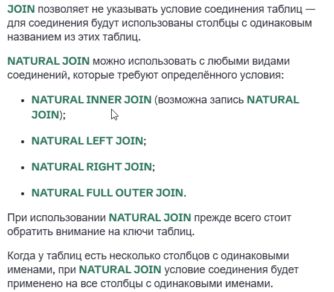

- 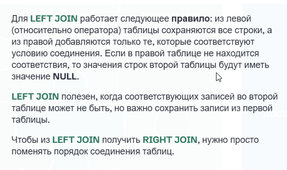

- 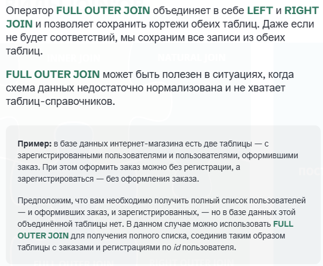

- 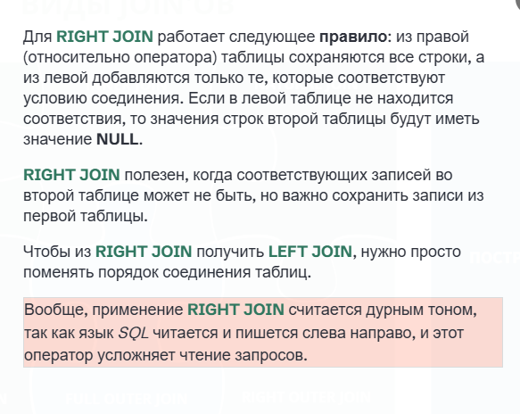