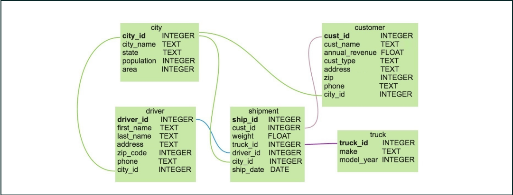
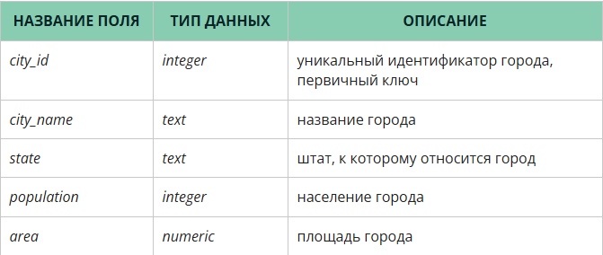
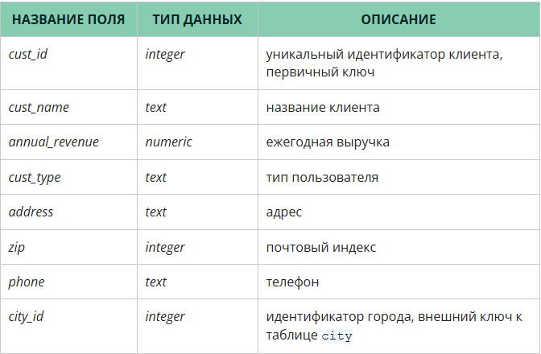
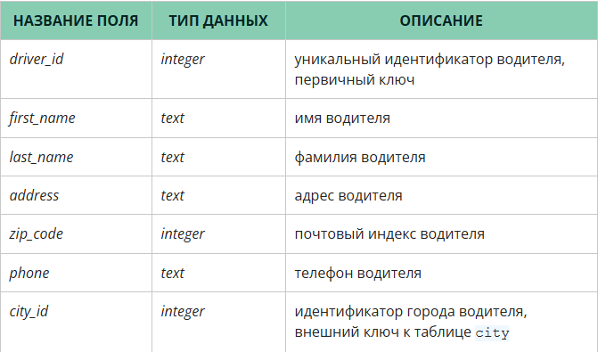
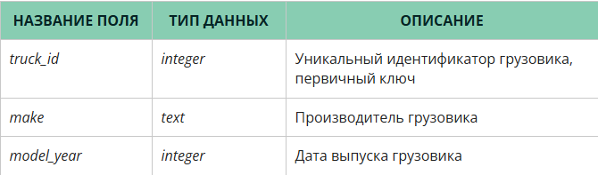
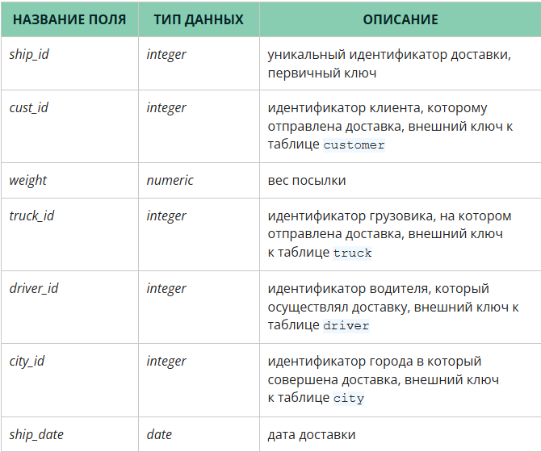

# Вы уже умеете присоединять строки друг к другу путём добавления столбцов «сбоку» — с помощью различных видов JOIN.

*А что если нам необходимо присоединить несколько результатов «снизу», так, чтобы получить общий результат в выводе?*

*Ответу на этот вопрос и посвящён текущий модуль.*

***Обратите внимание! Вы можете посмотреть подробный разбор структуры предлагаемых запросов во вкладке Детализация.***

*Но прежде, как всегда, разберёмся с датасетом*

*В данном блоке мы будем работать с данными о компании, организующей перевозки грузов.*

*Интересующие нас данные хранятся в таблицах city, customer, driver, shipment, truck. Давайте внимательно их изучим.*

*Ниже представлена ER-диаграмма (от англ. entity-relation, дословно — «сущность-связь»), которая отображает существующие связи между отдельными таблицами.*

*Таблица city — это справочник городов. Структура справочника представлена ниже.*

*Таблица customer — это справочник клиентов. У компании, с данными которой мы работаем, только корпоративные клиенты, поэтому в таблице нет привычных данных о возрасте и поле. Справочник содержит следующие поля:*

*Следующая таблица — driver — справочник водителей. Перечень сведений, содержащихся в таблице, представлен ниже.*

*В таблице truck хранится информация о грузовиках, на которых осуществляются перевозки. Данные о них представлены в следующем виде:*

*Последняя таблица в датасете, shipment, — таблица с данными непосредственно о доставках. Она описывает взаимодействие всех перечисленных сущностей, а потому содержит наибольшее количество ссылок на другие таблицы.*

### Задание 1.1
*Укажите имя клиента, получившего наибольшее количество доставок за 2017 год.*

**select
c.cust_name,
count (s.ship_id)
from sql.customer c
join sql.shipment s on c.cust_id = s.cust_id
where s.ship_date between '01-01-2017' and '12-31-2017'
Group by cust_name 
order by 2 desc ,1**

