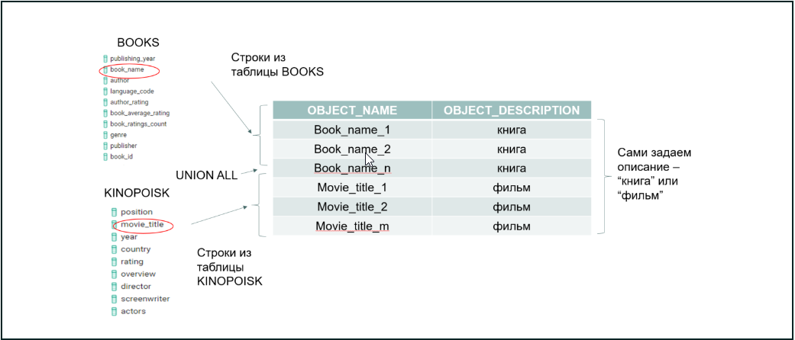
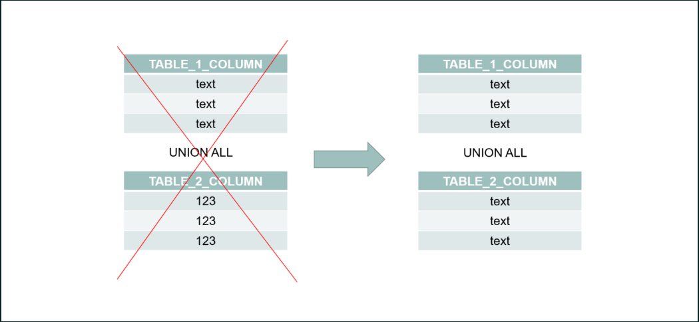
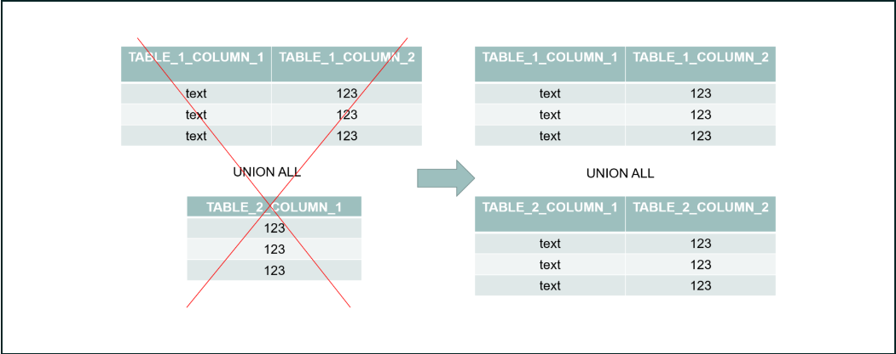
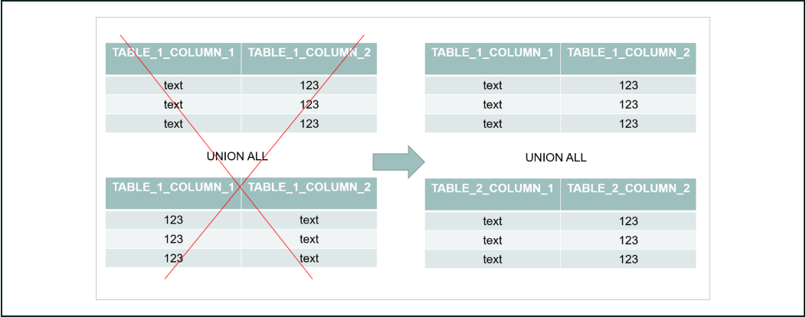

# Принцип и условия работы Union

*Чтобы разобраться в этом вопросе, смоделируем ситуацию.*

*Допустим, мы хотим собрать из справочников по книгам и фильмам один, так чтобы в нём содержались названия произведений, а также их описание — книга или фильм.*

*Для этого напишем простой запрос:*

**SELECT          book_name object_name, 'книга' object_description 
FROM          public.books
UNION ALL
SELECT          movie_title, 'фильм' 
FROM          sql.kinopoisk**

*Визуально произведённое нами действие можно представить следующим образом:*

*Общий принцип мы поняли, разберёмся в деталях:*

*В запросе мы использовали оператор UNION ALL — он присоединяет любой результат запроса к другому «снизу» при условии, что у них одинаковая структура, а именно:*

***1. одинаковый тип данных***

***2. одинаковое количество столбцов***

***3. одинаковый порядок столбцов согласно типу данных.***

### Виды UNION

*Оператор присоединения существует в двух вариантах:*

***- UNION выводит только уникальные записи;***

***- UNION ALL присоединяет все строки последующих таблиц к предыдущим, без ограничений по уникальности.***

***Важно!*** *UNION оставляет только уникальные значения, а потому требует дополнительных вычислительных мощностей и памяти (в данном случае можно провести аналогию с DISTINCT). Поэтому если вы уверены в отсутствии дубликатов в данных или они вам не важны, предпочтительнее использовать UNION ALL.*

*Проверить, как различаются операторы, вы сможете при выполнении заданий 2.1 и 3.1.*

### Синтаксис

*Запрос строится таким образом:*

**SELECT         n columns
FROM 
         table_1
UNION ALL
SELECT 
         n columns
FROM 
         table_2
...
UNION ALL
SELECT 
         n columns
FROM 
         table_n**

*Результатом выполнения такого запроса будут строки table_1, table_2, ..., table_n, соединённые одни под другими и выведенные в единой выдаче.*

***Важно!*** *Названия итоговых колонок в выводе будут такие же, как в первом блоке SELECT, даже если они отличаются в других блоках подзапросов.*

*Пришла пора испытать функцию UNION(ALL) на практике.*

*Обратимся к нашему датасету о транспортной компании и посмотрим, как сформировать справочник с ID всех таблиц и указанием объекта, к которому он относится.*

**SELECT
         c.city_id object_name, 'id города' object_type
FROM 
         sql.city c
UNION ALL
SELECT
         d.driver_id other_name, 'id водителя' other_type
FROM 
         sql.driver d
UNION ALL
SELECT
         s.ship_id, 'id доставки'
FROM 
         sql.shipment s
UNION ALL
SELECT
         c.cust_id, 'id клиента'
FROM 
         sql.customer c
UNION ALL
SELECT
         t.truck_id, 'id грузовика'
FROM 
         sql.truck t
ORDER BY 1**

***Обратите внимание!*** *Несмотря на исходные названия колонок other_name и other_type во втором подзапросе, в выводе мы получим названия, которые дали в первом блоке: object_name и object_type.*

***Другая особенность — в применении сортировки ORDER BY: она всегда будет относиться к итоговому результату всего запроса с UNION ALL.***

*В случаях, когда необходимо применить команду ORDER BY или LIMIT не к итоговому результату, а к каждой части запроса, можно обернуть подзапросы в скобки.*

*Чтобы посмотреть, как это работает, вернёмся к нашему примеру с общим справочником по фильмам и книгам.*

*Мы уже знаем, что можно легко и непринуждённо применить операторы ORDER BY и LIMIT ко всему результату запроса.*

**SELECT book_name object_name, 'книга' object_descritption 
FROM public.books
UNION ALL
SELECT movie_title, 'фильм' 
FROM sql.kinopoisk
ORDER BY 1
LIMIT 1**

**Всё бы хорошо, только в таком случае отсортирован будет весь общий справочник, а в выводе останется одна строка с названием объекта, идущим первым по алфавиту.**

**А если мы не хотим общую сортировку? Может, нам нужны строки с названием как фильма, так и книги, идущих первыми по алфавиту.**

**Нет ничего проще — отсортируем каждую часть запроса по отдельности и объединим результаты!**

*Просто добавим ORDER BY и LIMIT ещё и в первую часть запроса:*

**SELECT book_name object_name, 'книга' object_descritption 
FROM public.books
ORDER BY 1
LIMIT 1
UNION ALL
SELECT movie_title, 'фильм' 
FROM sql.kinopoisk
ORDER BY 1
LIMIT 1**

*Вместо результата получим сообщение о синтаксической ошибке: "...syntax error at or near "UNION"..." Очевидно, этот фокус не удался.*

*Не стоит огорчаться, ведь проблему можно решить одним (ну, почти) движением руки — просто добавив скобки вокруг каждой из частей запроса.*

**(SELECT book_name object_name, 'книга' object_descritption 
FROM public.books
ORDER BY 1
LIMIT 1)
UNION ALL
(SELECT movie_title, 'фильм' 
FROM sql.kinopoisk
ORDER BY 1
LIMIT 1)**

*Отлично! Мы получили именно то, что хотели.*

### Задание 2.1

*Напишите запрос, который создает уникальный алфавитный справочник всех городов, штатов, имён водителей и производителей грузовиков. Результатом запроса должны быть два столбца: название и тип объекта (city, state, driver, truck). Отсортируйте список по названию объекта, а затем — по типу.*

**SELECT c.city_name "название", 'city' "тип объекта"
FROM sql.city c
UNION
SELECT c.state, 'state'
FROM sql.city c
UNION
SELECT d.first_name, 'driver'
FROM sql.driver d
UNION
SELECT t.make, 'truck'
FROM sql.truck t
ORDER BY 1,2**

### Задание 2.2

*Напишите запрос, который соберёт имена всех упомянутых городов и штатов из таблицы city. Результатом запроса должен быть один столбец object_name, отсортированный в алфавитном порядке.*

**SELECT c.city_name object_name
FROM sql.city c
UNION ALL
SELECT c.state
FROM sql.city c
ORDER BY 1**

### Задание 2.3

*Выполнив предыдущий запрос, мы получили города с одинаковыми названиями, но находящиеся в разных штатах, а также большое количество дублирующихся названий штатов. Перепишите предыдущий запрос так, чтобы остались только уникальные названия городов и штатов. Результатом запроса должен быть один столбец object_name, отсортированный в алфавитном порядке.*

**SELECT c.city_name object_name
FROM sql.city c
UNION
SELECT c.state
FROM sql.city c
ORDER BY 1**