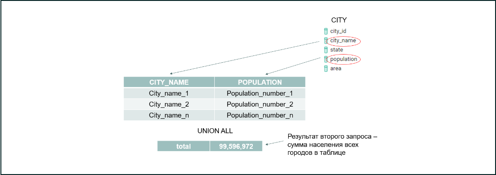

# Возможности UNION 

*Помимо соединения разнородных сущностей в единый справочник, UNION ALL часто используется для подведения промежуточных итогов и выведения результатов агрегатных функций.*

*Кроме агрегатных функций, в запросах с UNION могут использоваться функции группировки и выборки.*

*Попробуем вывести обобщённые данные о населении по всем городам, с детализацией до конкретного города.*

**SELECT
         c.city_name,
         c.population
FROM
         sql.city c
UNION ALL
SELECT
         'total',
         SUM(c.population)
FROM
         sql.city c
ORDER BY 2 DESC**

*Визуально это действие можно представить так:*

*Выполнив запрос в Metabase, вы заметите, что сначала выведен итоговый результат с суммой населения всех городов в таблице, а затем по каждому городу в отдельности.*

### Задание 4.1

*Напишите запрос, который выводит общее число доставок total_shipments, а также количество доставок в каждый день. Необходимые столбцы: date_period, cnt_shipment. Не забывайте о единой типизации. Упорядочите по убыванию столбца date_period.*

**SELECT
    s.ship_date:: text date_period,
    count(s.ship_id) cnt_shipment
FROM
     sql.shipment s
group by s.ship_date
UNION ALL
SELECT
    'total_shipments',
     COUNT(s.ship_id)
FROM
    sql.shipment s
ORDER BY 2 DESC**