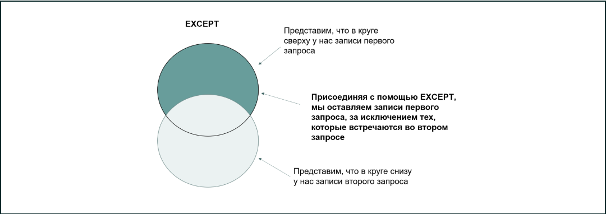
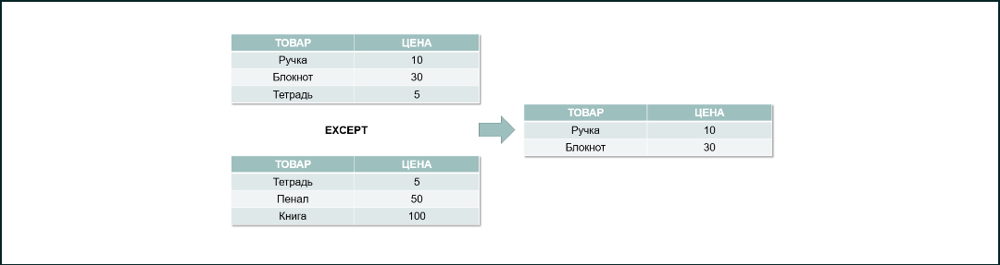

# Исключаем повторяющиеся данные

*Предположим, нам нужно узнать, в какие города осуществлялась доставка, за исключением тех, в которых проживают водители.*

**SELECT
         c.city_name
FROM
         sql.shipment s
JOIN sql.city c ON s.city_id = c.city_id
EXCEPT
SELECT
         cc.city_name
FROM
         sql.driver d 
JOIN sql.city cc ON d.city_id=cc.city_id
ORDER BY 1**

*Все водители проживают в городе Memphis, и мы видим, что он не выводится в результате запроса.*

*Чтобы лучше понять данный тип присоединения, предлагаем ознакомиться с диаграммой Венна — математическим инструментом, представляющим возможные логические связи между соединёнными наборами данных.*

*Синтаксические правила для оператора EXCEPT такие же, как и для UNION:*

- *одинаковый тип данных;*
- *одинаковое количество столбцов;*
- *одинаковый порядок столбцов согласно типу данных.*

*Синтаксис выглядит следующим образом:*

**SELECT 
    n columns
FROM 
    table_1
EXCEPT
SELECT 
    n columns
FROM 
     table_2**

**Мы уже знаем, как решить такую задачу с использованием LEFT JOIN. Вариант с EXCEPT будет полезен в тех случаях, когда у вас много столбцов и вам не хочется прописывать их равенство в условии для JOIN.**

*Предположим, у нас есть информация о продажах канцелярского магазина за май и июнь.*

*Какие-то позиции продавались и в том, и в другом месяце, а какие-то — только в одном. Использовав EXCEPT, мы можем оставить только те товары, которые есть в первом запросе (например, за май), но отсутствуют во втором запросе (например, за июнь).*

*Графически действие оператора можно представить следующим образом:*

*Таким образом, при присоединении с помощью EXCEPT мы вывели только те товары, которые были проданы в мае, но не в июне. Чтобы найти продажи по тем позициям, что были реализованы в июне, а в мае — нет, необходимо поменять запросы местами.*

### Задание 7.1

*Выведите список zip-кодов, которые есть в таблице sql.driver, но отсутствуют в таблице sql.customer. Отсортируйте по возрастанию, столбец к выводу — zip. В поле ниже введите запрос, с помощью которого вы решили эту задачу.*

**SELECT 
    zip_code zip
from sql.driver
except
SELECT 
    zip zip
from sql.customer
order by 1**