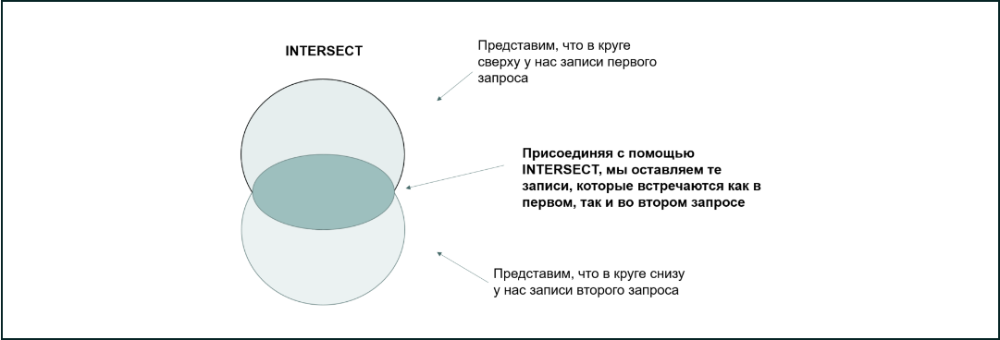

# Выбираем общие данные

*А что если нам надо вывести общие записи — те, что существуют в нескольких таблицах?*

*Предположим, нам надо вывести совпадающие по названию города и штаты.*

**SELECT          c.city_name object_name
FROM          sql.city c
INTERSECT
SELECT 
         cc.state
FROM          sql.city cc
ORDER BY 1**

*Как видим, с помощью оператора INTERSECT мы вывели названия городов и штатов, которые совпадают: New York, Washington и Wyoming. Присмотримся к нему внимательнее.*

*Чтобы лучше понять, как работает этот оператор, вновь обратимся к диаграмме Венна: INTERSECT оставляет из результатов первого запроса все строки, которые совпали с результатом выполнения второго запроса.*

*Синтаксис запроса с оператором INTERSECT выглядит следующим образом:*

**SELECT 
         n columns
FROM 
         table_1
INTERSECT
SELECT 
         n columns
FROM 
         table_2**\

*Вернёмся к нашему примеру с продажами канцтоваров.*

*С помощью оператора INTERSECT мы можем вывести те позиции, которые продавались и в мае, и в июне. Визуализировать это действие можно примерно так:*

*Оператор INTERSECT оставляет только те строки, которые являются общими для двух запросов (в нашем примере это Тетрадь).*

***Как EXCEPT, так и INTERSECT убирают дубликаты, если они имеются.***

### Задание 8.1

*Напишите запрос, который выведет список id городов, в которых есть и клиенты, и доставки, и водители.*

**SELECT  
c.city_id object_name
FROM sql.city c
INTERSECT
SELECT 
    cc.city_id
FROM    sql.customer cc
INTERSECT
SELECT 
    d.city_id
FROM    sql.driver d
INTERSECT
SELECT 
    s.city_id
FROM    sql.shipment s**

### Задание 8.2

*Выведите zip-код, который есть как в таблице с клиентами, так и в таблице с водителями.*

**SELECT 
    cc.zip zip
FROM    sql.customer cc
INTERSECT
SELECT 
    d.zip_code
FROM    sql.driver d**