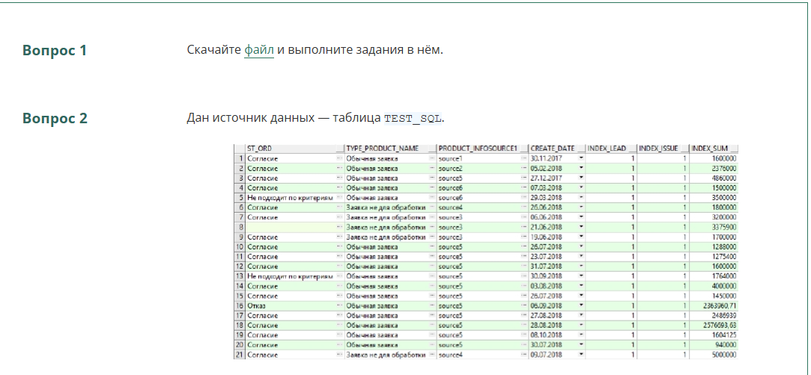
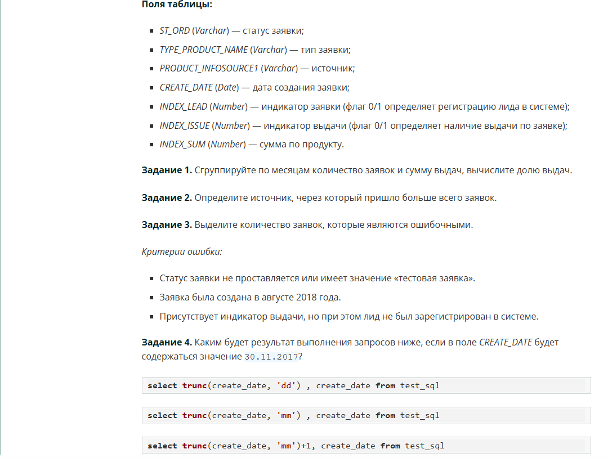

# Закрепление знаний

*В этом модуле вы освоили ещё несколько возможностей из функционала SQL.*

*Теперь вы умеете:*

- *присоединять таблицы «снизу», одну под другой;*
- *исключать или, наоборот, выбирать повторяющиеся записи из двух таблиц;*
- *вручную добавлять записи в таблицу.*

*Запишем структуру запроса с учётом полученных знаний.*

**SELECT          N columns
FROM          table_1
UNION / UNION ALL / EXCEPT / INTERSECT 
SELECT          N columns
FROM          table_2**

### Задание 9.1

*Выведите города с максимальным и минимальным весом единичной доставки. Столбцы к выводу — city_name, weight.*

**(
    SELECT
       c.city_name,
       s.weight
    FROM sql.shipment s
       JOIN sql.city c ON s.city_id=c.city_id
    ORDER BY 2 desc
    LIMIT 1
)
UNION ALL
(
    SELECT
       c.city_name,
       s.weight
    FROM sql.shipment s
       JOIN sql.city c ON s.city_id=c.city_id
    ORDER BY 2
    LIMIT 1
)**

### Задание 9.2

*Выведите идентификационные номера клиентов (cust_id), которые совпадают с идентификационными номерами доставок (ship_id). Столбец к выводу — mutual_id. Отсортируйте по возрастанию.*

**SELECT cust_id mutual_id
FROM sql.customer
INTERSECT
SELECT ship_id
FROM sql.shipment
ORDER BY 1**

### Задание 9.3

*Создайте справочник, содержащий уникальные имена клиентов, которые являются производителями (cust_type='manufacturer'), и производителей грузовиков, а также описание объекта — 'КЛИЕНТ' или 'ГРУЗОВИК'. Столбцы к выводу — object_name, object_description. Отсортируйте по названию в алфавитном порядке.*

**SELECT cust_name object_name, 'КЛИЕНТ' object_description
FROM sql.customer
WHERE cust_type='manufacturer'
UNION
SELECT make, 'ГРУЗОВИК'
FROM sql.truck
ORDER BY 1**

### И это ещё не всё!

*Знания по темам этого модуля зачастую проверяют работодатели на собеседованиях. Предлагаем вам ознакомиться с вопросами, с которыми вы можете столкнуться при поиске работы. *

***Важно!*** *Это задания на самопроверку, они необязательные и мы не будем оценивать качество их решения. На некоторые вопросы будет предоставляться ответ, а на некоторые — нет. Настоятельно рекомендуем вам попробовать найти ответ самостоятельно, прежде чем открывать его.*

