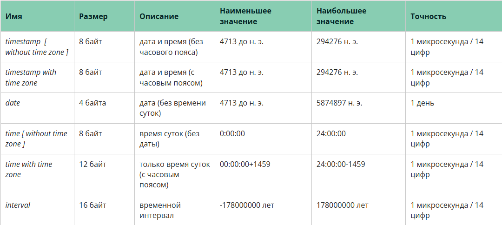
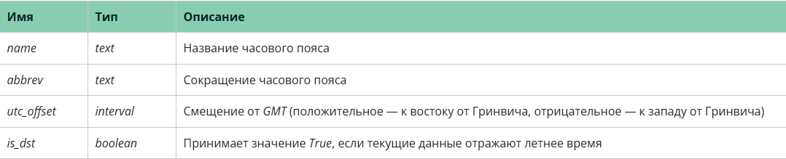
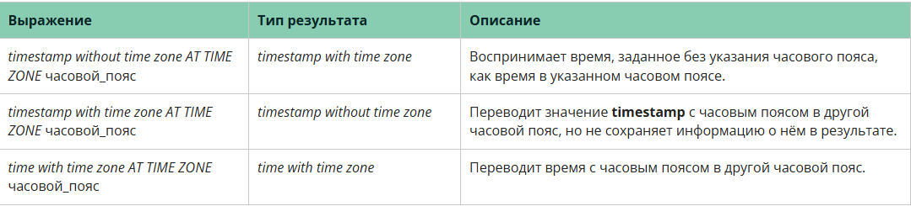
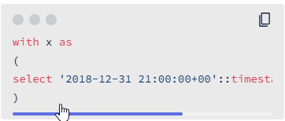
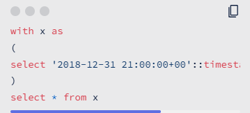

# Любой анализ событий во времени подразумевает работу с датой или временем.

*Для них в Postgres существует несколько типов данных — все они представлены в таблице ниже.*

*Давайте подробно разберём каждый из этих типов и выясним, в каких случаях и для чего они используются.*

### TIMESTAMP

***Timestamp*** — *наиболее распространённый тип данных, так как он содержит и дату, и время, а также используется в любых логах событий, временных рядах и в большинстве системных таблиц.*

*Согласно стандарту ISO, значение выглядит как "2019-07-14 01:35:44.702165+00", где перечислены через точку год-месяц-день, время и часовой пояс.*

*Для получения текущего значения даты и времени в Postgres используются функции CURRENT_TIMESTAMP (есть в стандарте SQL) и NOW() (есть в большинстве баз данных).*

*Выполните запросы SELECT NOW() и SELECT CURRENT_TIMESTAMP.*

*Глядя на вывод, вы заметите, что время отличается на целое число часов от реального времени у вас (если вы не в Лондоне или, скажем, на Канарских островах). В Москве разница составит 3 часа.*

### Timestamp with time zone

***Timestamp with time zone*** *позволяет хранить сведения о часовом поясе, что может быть удобно при анализе географически распределённых временных данных для единообразия хранения.*

*Предположим, в вашей компании в базу подтягивается время прихода сотрудников на работу. Вы пришли в 10 утра по Москве, а в Екатеринбурге в это время — полдень. Чтобы ваши коллеги из Екатеринбурга поняли, что вы пришли на работу вовремя, им нужно помнить про разницу в часовых поясах. А теперь представим, что пользователи БД разбросаны по всему миру и всем им необходимо помнить о разнице во времени и учитывать её при сверках с другими регионами.*

*Согласитесь, неудобно. Поэтому временные метки лучше всего хранить в базе в едином часовом поясе.*

*Посмотрим, как работает этот тип данных.*

*Сначала попробуем узнать, в каком часовом поясе выводятся временные данные в настоящий момент. Для этого выполните команду*

***show timezone***

*В результате вы увидите GMT — это наиболее частая установка по умолчанию для баз данных. Что он обозначает, можно посмотреть [здесь.](https://ru.wikipedia.org/wiki/%D0%A1%D1%80%D0%B5%D0%B4%D0%BD%D0%B5%D0%B5_%D0%B2%D1%80%D0%B5%D0%BC%D1%8F_%D0%BF%D0%BE_%D0%93%D1%80%D0%B8%D0%BD%D0%B2%D0%B8%D1%87%D1%83)*

*Список часовых поясов можно увидеть в системном справочнике* ***pg_timezone_names.***

*Описание этого справочника вы не сможете посмотреть в Metabase, но можете к нему обратиться, написав SQL-запрос.*

*А ещё посмотрите ваше время в каком-нибудь часовом поясе, например, в Москве. Для этого выполните в Metabase запрос*

***select now() at time zone 'Europe/Moscow'***

*Указание **at time zone** позволяет переводить дату/время без часового пояса в дату/время с часовым поясом и обратно, а также пересчитывать значения времени для различных часовых поясов.*

*В таблице ниже приведены примеры того, как работает ***at time zone*** для разных типов данных.*

### Задание 3.1

*Давайте узнаем, сколько сейчас времени в другом регионе, например Лос-Анджелесе. Напишите запрос, который выведет текущие время и дату в часовом поясе Лос-Анджелеса ("America/Los_Angeles"). Столбец в выдаче — now (время и дата в нужном часовом поясе).*

**select now() at time zone 'America/Los_Angeles' as now**

### Date

*С типом date вы уже знакомы, его реализация предельно проста. Отметим только, что тип timestamp (with/without time zone) можно легко перевести в соответствующую дату, используя синтаксис*

***"timestamp_column"::date***

*И наоборот, тип date преобразуется в timestamp (дата и 00:00:00) с помощью*

***"date_column"::timestamp***

*Для получения текущей даты можно использовать*

***select CURRENT_DATE***

*или*

***select now()::date***

### Задание 3.2
*Предположим, у нас есть дата и время какого-то события и мы хотим посмотреть, к какой дате оно относится для Москвы и для UTC. Используйте следующий подзапрос и выведите дату в ts в Московском часовом поясе и в поясе UTC:*

*Столбцы в выдаче: dt_msk (дата в московском часовом поясе), dt_utc (дата в UTC).*

**Примечание:** *в данном куске SQL-кода мы обозначаем результат запроса SQL как таблицу с именем x. В этой таблице содержится столбец ts. Воспользуйтесь этой таблицей для решения задачи. Например, чтобы посмотреть всё содержимое таблицы x, достаточно написать следующий запрос:*

*Узнать больше об операторе with можно [здесь](https://sql-academy.org/ru/guide/operator-with)*

**with x as 
(
select '2018-12-31 21:00:00+00'::timestamp with time zone ts
)
select ((ts at time zone 'Europe/Moscow')::date)::text as dt_msk,
(ts::date)::text as dt_utc
from x**

### Interval

***Interval*** *— тип данных, позволяющий хранить разницу между двумя временными метками.*

*Интервалы хранят данные в трёх отдельных полях — месяцах, днях, секундах. Это сделано из-за того, что количество дней в месяце и часов в дне может быть разным. Пример значения такого типа: "195 days -10:52:23.563955".*

*Подробнее о том, как работают интервалы, мы узнаем позже, на примере конкретных функций, с помощью которых можно вычислять эти интервалы и работать с ними.*