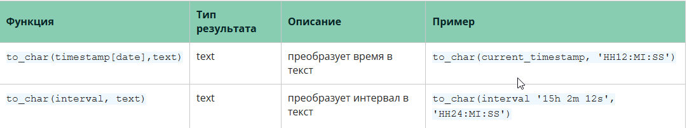
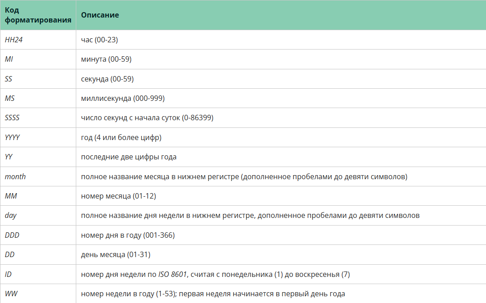
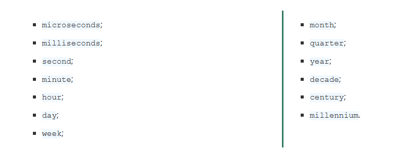

# Функции

### Функция extract()

*Функция extract() получает из значений даты/времени такие поля, как год или час.*

*Здесь источник — значение типа timestamp, time или interval. Допускается и тип date, поскольку он приводится к типу timestamp.*

*Указанное поле представляет собой идентификатор, по которому из источника выбирается заданное поле. Функция extract() возвращает значения типа double precision.*

- **day**

*Для значений timestamp это день месяца (1-31), для значений interval — число дней.*

***SELECT EXTRACT(DAY FROM TIMESTAMP '2001-02-16 20:38:40');***
*Результат: 16*

***SELECT EXTRACT(DAY FROM INTERVAL '40 days 1 minute');***
*Результат: 40*

- **hour**

*Час (0-23).*

***SELECT EXTRACT(HOUR FROM TIMESTAMP '2001-02-16 20:38:40');***
*Результат: 20*

- **month**

*Номер месяца, считая с января (1) до декабря (12).*

***SELECT EXTRACT(MONTH FROM TIMESTAMP '2001-02-16 20:38:40');**
*Результат: 2*

- **year**

*Поле года. Учтите, что года 0 не было, и это следует иметь в виду, вычитая из годов нашей эры годы до нашей эры.*

**SELECT EXTRACT(YEAR FROM TIMESTAMP '2001-02-16 20:38:40');**
*Результат: 2001*

- **isoyear**

*Год по недельному календарю ISO 8601, в который попадает дата (не применимо к интервалам).*

**SELECT EXTRACT(ISOYEAR FROM DATE '2006-01-01');**
*Результат: 2005*

**SELECT EXTRACT(ISOYEAR FROM DATE '2006-01-02');**
*Результат: 2006*

*Год по недельному календарю ISO начинается с понедельника недели, в которой оказывается 4 января, так что в начале января или в конце декабря год по ISO может отличаться от года по григорианскому календарю. Подробнее об этом рассказывается в описании поля week.*

- **week**

*Номер недели в году по недельному календарю ISO 8601. По определению, недели ISO 8601 начинаются с понедельника, а первая неделя года включает 4 января этого года. Другими словами, первый четверг года всегда оказывается в первой неделе этого года.*

*В системе нумерации недель ISO первые числа января могут относиться к 52-й или 53-й неделе предыдущего года, а последние числа декабря — к первой неделе следующего года.*

*Например, 2005-01-01 относится к 53-й неделе 2004 г., а 2006-01-01 — к 52-й неделе 2005 г., тогда как 2012-12-31 включается в первую неделю 2013 г.*

*Поэтому для получения согласованных результатов рекомендуется использовать поле isoyear в паре с week.*

**SELECT EXTRACT(WEEK FROM TIMESTAMP '2001-02-16 20:38:40');**
*Результат: 7*

- **century**

**SELECT EXTRACT(CENTURY FROM TIMESTAMP '2000-12-16 12:21:13');**
*Результат: 20*

**SELECT EXTRACT(CENTURY FROM TIMESTAMP '2001-02-16 20:38:40');**
*Результат: 21*

*Первый век начался 0001-01-01 00:00:00, хотя люди в то время так и не считали. Это определение распространяется на все страны с григорианским календарём.*

*Века с номером 0 не было; считается, что 1 наступил после -1.*

*Если такое положение вещей вас не устраивает, направляйте жалобы по адресу: Ватикан, Собор Святого Петра, Папе Римскому, лично в руки :)*

- **decade**

*Десятилетие.*

**SELECT EXTRACT(DECADE FROM TIMESTAMP '2001-02-16 20:38:40');**
*Результат: 200*

- **epoch**

*Для значений timestamp with time zone это число секунд с 1970-01-01 00:00:00 UTC (может быть отрицательным); для значений date и timestamp это число секунд с 1970-01-01 00:00:00 по местному времени, а для interval — общая длительность интервала в секундах.*

**SELECT EXTRACT(EPOCH FROM TIMESTAMP WITH TIME ZONE
'2001-02-16 20:38:40.12-08');**
*Результат: 982384720.12*

**SELECT EXTRACT(EPOCH FROM INTERVAL '5 days 3 hours');**
*Результат: 442800*

*Преобразовать время эпохи обратно, в значение дата/время, с помощью to_timestamp можно так:*

**SELECT to_timestamp(982384720.12);**
*Результат: 2001-02-17 04:38:40.12+00*

- **dow**

*День недели, считая с воскресенья (0) до субботы (6).*

**SELECT EXTRACT(DOW FROM TIMESTAMP '2001-02-16 20:38:40');**
*Результат: 5*

*Заметьте, что в extract() дни недели нумеруются не так, как в функции to_char(..., 'D').*

- **doy**

*День года (1-365/366).*

**SELECT EXTRACT(DOY FROM TIMESTAMP '2001-02-16 20:38:40');**
*Результат: 47*

- **isodow**
*День недели, считая с понедельника (1) до воскресенья (7).*

**SELECT EXTRACT(ISODOW FROM TIMESTAMP '2001-02-18 20:38:40');**
*Результат: 7*

*Результат отличается от dow только для воскресенья. Такая нумерация соответствует ISO 8601.*

### Задание 4.1 

*Давайте посчитаем помесячную статистику по доставкам, используя функцию extract. Напишите запрос, который выведет год, месяц и количество доставок. Отсортируйте по году и по месяцу в порядке возрастания. Столбцы в выдаче: year_n (номер года), month_n (номер месяца), qty (количество доставок).*

**Select
    extract (year from ship_date) year_n,
    extract (month from ship_date) month_n,
    count(ship_id) qty
from sql.shipment
group by year_n, month_n
order by year_n, month_n**

### Функция to_char()

*Функция to_char() нужна для форматирования даты времени и интервалов в нужный текст.*

*Например, вы хотите вывести год, месяц и день со специфическим разделителем или получить текстовое наименование месяца или дня недели. По результату работы она очень близка к extract(), но больше нацелена именно на форматирование. Ниже вы видите таблицу с примерами вызовов:*

*Первый параметр для функции — дата, время или интервал, а второй — текстовая маска получаемого результата. Перечень значений, которые можно использовать для маски, представлен в таблице ниже.*

*Полный перечень вы можете посмотреть в [подсказке по кодам форматирования](https://postgrespro.ru/docs/postgrespro/9.5/functions-formatting) или таблице (чтобы увидеть её кликните Показать).*

*Любой текст, который относится к кодам форматирования, будет сохранён как есть. Чтобы оставлять какие-то подсказки и использовать обычные буквы, которые не встречаются в таблице выше, необходимо заключить текст, который нужно оставить без изменений,* ***в двойные кавычки.***

*Предположим, мы хотим вывести сегодняшнюю дату в формате "Hello! Today is #название дня недели год.название месяца.день#" текстом. Для этого нужно выполнить следующий код:*

**select to_char(now(),'"Hello! Today is" DAY yyyy-Mon-dd')**

*Также поэкспериментируйте с разными видами форматирования и произвольными текстами.*

### Задание 4.2

*Давайте выведем текст текущего времени для сервиса точного времени. Напишите запрос, который выводит текст "Точное время x часов y минут z секунд" (текст в кавычки заключать не нужно), где x, y, z — часы, минуты и секунды соответственно, при условии, что сообщение нужно вывести для московского часового пояса. Время введите в 24-часовом формате. Столбцы в выдаче: msg (сообщение)*

**select to_char(now() at time zone 'Europe/Moscow','"Точное время" HH24 "часов" MI "минут" SS "секунд"') msg**

### Функция date_trunc()

*Функция date_trunc() позволяет отсечь заданное время, дату или дату со временем до нужной точности.*

*Формат вызова:*

**date_trunc('поле', значение)**

*Например, если мы хотим округлить текущее время-дату до минут, то можно вызвать*

**select date_trunc('minute',now())**

*Для получения разной степени точности вместо minute можно использовать следующие параметры:*

*Из их названий легко понять, какая временная единица подразумевается.*

### Задание 4.3

*Давайте подготовим данные для квартальной отчётности компании. Напишите запрос, который выведет дату доставки, округлённую до квартала, и общую массу доставок. Отсортируйте по кварталу в порядке возрастания. Столбцы в выдаче: q (начало квартала, тип date), total_weight (сумма масс доставок за квартал).*

**SELECT
    date_trunc('quarter',s.ship_date)::date q,
    sum(s.weight) total_weight
FROM
    shipping.shipment s
GROUP BY 1
ORDER BY 1**

### Математические операторы

*К любой дате можно прибавить (и вычесть из неё) целое число X и получить другую дату, которая больше (меньше) изначальной.*

*Пример:*

**select '2019-01-01'::date + 10**
*Результат: '2019-01-11'*

*Это — дата на 10 дней позже 2019-01-01.*

*При добавлении (или вычитании) целого числа к дате Postgres учитывает переходы между месяцами и годами и даёт верный ответ, соответствующий календарю. Учитываются даже високосные годы.*

*Пример:*

**select '2019-01-01'::date + 500**
*Результат: '2020-05-15'*

*Как видим, сменились и год, и месяц, и день.*

*Аналогично можно вычесть из одной даты другую и получить расстояние в днях между этими датами. При такой операции тоже будет честная разница по календарю.*

*Пример:*

**select '2019-02-10'::date - '2017-03-01'::date**
*Результат: 711*

### Задание 4.4

*Давайте оценим, в каком интервале совершались доставки в разных городах. Напишите запрос, который выведет разницу между последним и первым днём доставки по каждому городу. Отсортируйте по первому и второму столбцам. Столбцы в выдаче: city_name (название города) и days_active (время от первой до последней доставки в днях).*

**Select
    city_name,
    max(ship_date)::date - min(ship_date)::date days_active
from sql.city c
    join sql.shipment s on c.city_id=s.city_id
group by city_name
order by 1,2**