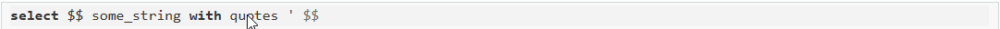

# Операторы

### Соединение строк

*Для начала познакомимся с оператором конкатенации строк — || (две вертикальные черты). Он позволяет объединять две и более строки.*

*Конструкции с оператором соединения строк записываются следующим образом:*

*строка1 || строка2 || ... || строкаN*

***Важно!*** *Результатом соединения любых типов строковых данных будет тип text.*

*Напишем запрос, который позволит подготовить простые select-запросы для всех таблиц из схемы.*

**select 'select * from '||t.table_schema||'.'||t.table_name||';' query
from information_schema.tables t
where table_schema = 'shipping'**

*В результате должно получиться пять SQL-запросов, по одному к каждой таблице из схемы shipping.*

*Как мы видим, соединять можно и рукописный текст, и значения столбцов в любом произвольном порядке.*

***Важно!*** *Если вы соединяете любую строку и NULL, то результатом будет NULL. Поэтому, если вы формируете какой-то текст на основе поля, в котором присутствует NULL, используйте оператор coalesce.*

### Задание 6.1 

*Составим текстовый шаблон сообщения о доставке по конкретному водителю для наших клиентов. Напишите SQL-запрос, который выведет следующее сообщение для каждого водителя по форме:*

***Ваш заказ доставит водитель #Имя Фамилия#. Его контактный номер: #Номер#***

*Где #Имя Фамилия# и #Номер# взяты из справочника водителей. Если номер не указан, то выведите прочерк (-). Для номеров рекомендуем использовать COALESCE. Пример из таблицы для наглядности:*

***Ваш заказ доставит водитель Adel Al-Alawi. Его контактный номер: (901) 947-4433***

*Столбец к выдаче — msg (текст сообщения).*

**select 'Ваш заказ доставит водитель '||d.first_name||' '||d.last_name||'. '||'Его контактный номер: '|| COALESCE(d.phone,'-') msg
from sql.driver d**

### Функции UPPER() и LOWER()

*Функции upper(your_text) и lower(your_text) переводят каждый символ вашего текста в верхний и нижний регистр соответственно.*

*Пример:*

**select upper('Abc') s1 ,lower('xYz') s2**

*Чаще всего эти функции используются для унификации и стандартизации, особенно они актуальны для данных, введённых вручную.*

*Например, названия города в анкете можно написать разными способами, но символьный состав останется одним и тем же (Москва, москва, МОСКВА).*

*Результат функций upper() и lower() — тоже строковый, а значит, к нему можно применять все функции, применимые к этому типу данных.*

### Задание 6.2

*Cоставим справочник названий клиентов, у которых более десяти доставок. Данные сохраним в нижнем регистре, чтобы передавать их в другие системы (например, для обзвона), которые не чувствительны к регистру. Напишите запрос, который выводит все id названий клиентов, у которых более десяти доставок, в нижнем регистре. Отсортируйте результат по cust_id в порядке возрастания. Столбцы в выдаче: cust_id (id клиента) и cust_name (название клиента в нижнем регистре).*

**SELECT 
    c.cust_id,lower(cust_name) cust_name
FROM shipping.customer c
JOIN shipping.shipment s ON c.cust_id = s.cust_id
GROUP BY 1,2
HAVING COUNT(distinct s.ship_id)>10
ORDER BY 1**

### Replace()

*Запись строится следующим образом:*

*replace(string text, from text, to text)*

*Эта запись означает, что в исходной строке string мы заменяем все вхождения строки from на строку to.*

*Разберём на примере.*

***select replace('малако','а','о')***

*Результат выполнения такого запроса будет молоко, т. е. все буквы «а» в строке «малако» были заменены на «о».*

*С таким же успехом можно заменять строку, состоящую из нескольких символов.*

*Сделаем из слова «машина» слово «матрас».*

***select replace('машина','шина','трас')***

*В строке 'машина' мы заменили строку 'шина' на строку 'трас'.*

*Результат функции replace() — строка, а значит, к ней тоже можно применять все известные нам функции работы со строками.*

*Если вы хотите удалить из строки какие-то символы, то третьим параметром (to) передайте пустую строку ''(одинарные кавычки без символа внутри).*

*Например, сделаем из строки "Hello, world!" строку "Hello!".*

*select replace('Hello, world!',', world','')*

### Задание 6.3 

*Составим справочник utm-меток, для того чтобы передавать город и штат прямо в адресной строке. (Если вы не знаете, что такое utm-метка, почитайте статью на Вики. К программе курса это не относится, но знать полезно.) Напишите SQL-запрос, который выведет список сочетаний из справочника следующего вида: название_штата__название_города, где названия штата и города взяты из справочника городов и переведены в нижний регистр. Столбец к выдаче — utm (форматированный штат-город). Отсортируйте полученный справочник по алфавиту. Обратите внимание! Все пробелы в названиях городов и штатов замените символом '_' (одно нижнее подчёркивание), а для разделения названий города и штата используйте '__' (два последовательных нижних подчёркивания). Пример из таблицы для наглядности: new_jersey__union_city*

**SELECT 
        lower(replace(state||'__'||city_name,' ','_')) utm
FROM shipping.city
ORDER BY 1**

### Left() и Right()

*Функции left(string,n) и right(string,n) оставляют n левых или правых символов от строки, поданной на вход. Давайте разобьём строку 'Один два три' на слова, используя эти функции.*

***with t as
(
select 'Один два три'::text sample_string
)
select 
 left(t.sample_string,4) one,
 right(left(t.sample_string,8),3) two,
 right(t.sample_string,3) three
from t***

*Пример:*

***select left('0123456789', - 2), right('0123456789', - 2)***

*Результат: 01234567 и 23456789 (в первом случае — восемь символов с «отрезанными» 89 и во втором случае — восемь символов с «отрезанными» 01)*

### Задание 6.4

*Представим, что к вам пришёл разработчик, который хочет сократить поле state в таблице city до четырёх символов, и попросил проверить, останeтся ли значения в нём уникальными. Чтобы ответить на этот вопрос, напишите SQL-запрос, который выведет первые четыре символа названия штата и количество уникальных названий штатов, которому они соответствуют. Оставьте только те, которые относятся к двум и более штатам. Добавьте сортировку по первому столбцу. Столбцы в выдаче: code (четыре первых символа в названии штата), qty (количество уникальных названий штата, начинающихся с этих символов)*

**SELECT
                LEFT(state,4) code, 
                COUNT(distinct state) qty
        FROM shipping.city
        GROUP BY 1
    HAVING COUNT(distinct state)>1**

### Format()

*Функция format() используется для составления форматированного текста с подстановками. То же самое можно сделать через конкатенацию строк, но это неудобно и громоздко.*

*Допустим, у нас есть шаблон "Hello, #Имя пользователя#!" и таблица водителей, которым нужно вывести приветствие.*

*Через конкатенацию это можно сделать следующим образом:*

***select 'Hello, ' || d.first_name || '!' hello from shipping.driver d***

*Но если нужно подставить и имя, и фамилию, то соединений становится слишком много и сам шаблон становится трудночитаемым. Вот тут и приходит на помощь функция format().*

*Синтаксис функции выглядит следующим образом:*

***format(formatstr text [, argument1 text,argument2 text...])***

*где formatstr — это шаблон, который мы передаём. Это обычная строка, в которой указаны места для подстановки аргумента.*

*Вернёмся к задаче с приветствием водителя.*

*Теперь мы можем решить её с помощью format():*

*select format('Hello, %s!', d.first_name) from shipping.driver d*

*Комбинация символов %s обозначает, что вместо них будет подставлен один из аргументов, причём в том же порядке, что и в исходном столбце.*

*Напишем запрос, который описывает содержимое каждой строки в таблице в виде текста.*

***select format('driver_id = %s, first_name = %s, last_name = %s, address = %s, zip_code = %s, phone = %s, city_id = %s', driver_id, first_name, last_name, address, zip_code, phone, city_id) from shipping.driver d***

*Мы перечислили в строке семь пропусков (плэйсхолдеров, или мест для подстановки, — %s), передали семь параметров (все столбцы таблицы) и получили шаблон, заполненный значениями для каждой строки.*

*Если в вашем шаблоне присутствует одинарная кавычка, то для удобства можно вместо одинарных кавычек использовать $$ (два знака доллара):*

### Задание 6.5

*Давайте подготовим географическую сводку для каждого города. Напишите SQL-запрос, который выведет описание региона в следующем формате:*

***[city_name] is located in [state]. There's [population] people living there. Its area is [area]***

*Обратите внимание, точку в конце ставить не нужно. Отсортируйте по названию города в алфавитном порядке. Столбец к выдаче — str (сводка). Пример:*

***Abilene is located in Texas. There's 115930 people living there. Its area is 105.10***

**select
format($$%s is located in %s. There's %s people living there. Its area is %s$$, c.city_name, c.state, c.population, c.area) str
from sql.city c
order by 1**